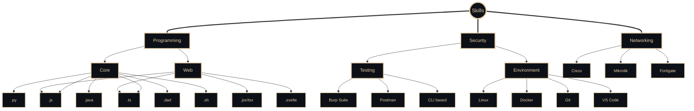

<!-- ####### First Section #######-->

<div style="border: 2px solid #E7CFAA; border-radius: 10px; padding: 20px; margin-bottom: 20px;">

<div align="center">

  <!-- Gif Image -->
  

  <div class="tenor-gif-embed" data-postid="9769138477087529056" data-share-method="host" data-aspect-ratio="1" data-width="100%"><a href="https://tenor.com/view/anime-luminous-luminus-luminas-valentine-gif-9769138477087529056"></div>

  <br>

  <!-- Name Banner -->
  <a href="https://github.com/LuminousVar">
    
  </a>

</div>

<br/>

<!-- Follow Buttons -->
<p align="center">
  <a href="https://komarev.com/ghpvc/?username=LuminousVar&color=E7CFAA">
    
  </a>
  <a href="https://github.com/LuminousVar"></a>
</p>


<br/>
<br/>
<br/>

<!-- ####### Second Section #######-->
<div style="border: 2px solid #E7CFAA; border-radius: 10px; padding: 20px; margin-bottom: 20px;">

<!-- Typing SVG -->
<div align="center">
  <a href="https://git.io/typing-svg">
    
  </a>
</div>

<br/>

<div align="center">
  <h3>😄 I Can Do</h3>
  <a href="https://git.io/typing-svg">
    
  </a>
</div>

<br/>
<br/>

  


<!-- Chatting Reference -->

```python
#!/usr/bin/python
# -*- coding: utf-8 -*-


class Bio:

    def __init__(self):
        self.real_name = "Farel"
        self.username = "LuminousV"
        self.role = "IT Network, Developer, Cyber Security, DevOps"
        self.language_spoken = ["id", "en"]

    def say_hi(self):
        print(f"Hi! Thanks to visit {self.username} Github")
        print("よろしくお願いします | Yoroshiku onegai shimasu")


my = Bio()
my.say_hi()
```

<br>
<br>


<!-- Quote -->
<div align="right">

  <a href="https://github.com/LuminousVar">
          
        </a>

  <table style="width: 420px; border: 1px solid #30363d; border-radius: 8px; padding: 15px; background-color: #0d1117;">
    <tr>
      <td valign="top" style="border: none;">
        <strong>LuminousVar</strong>
        <p style="margin-top: 5px; margin-bottom: 10px;">
          <b>English: </b>
          <i>"I'm not as skilled or GG as other people, but I am always level up every day."</i>
        </p>
        <p style="margin-top: 5px; margin-bottom: 10px;">
          <b>Indonesia: </b>
          <i>"Gw tidak sejago ataupun GG seperti orang orang, tapi gw selalu level up setiap harinya."</i>
        </p>
        <small style="color: #808080;">10:04 PM · 16 Agu 2025</small>
      </td>
    </tr>
  </table>

  
</div>

<br/>
<br/>
<br/>


 <!-- Knowledge & Skills -->
<p align="left" style="display: flex; align-items: center;">
  <a></a>
  
</p>



<br/>
<br/>
<br/>


<!-- ####### Third Section #######-->
<div style="border: 2px solid #E7CFAA; border-radius: 10px; padding: 20px; margin-bottom: 20px;">

<h2 align="center">
  
</h2>


<div align="center" style="display: flex; flex-direction: column; justify-content: center; align-items: center; background-color: #0D1117; padding: 20px; border-radius: 10px; box-shadow: 0 4px 6px rgba(0, 0, 0, 0.1);">
  <div style="display: flex; justify-content: center; align-items: center; margin-bottom: 20px;">
    
    
  </div>
  
  
</div>

</div>
