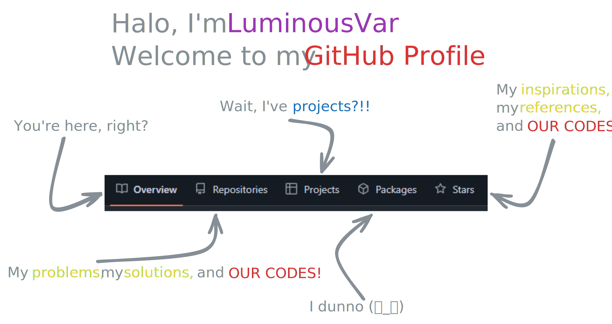
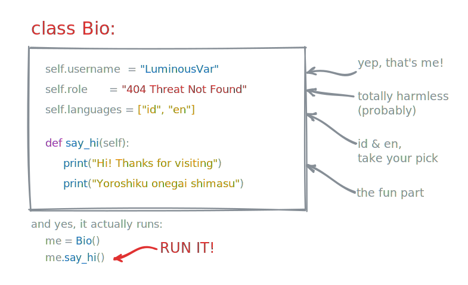
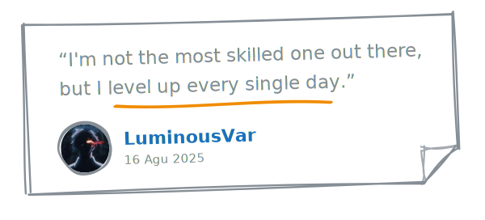

  

 

<!-- # Tambahkan informasi bahwa ini adalah github profile views -->

**GitHub Profile Views**

<!-- ####### Second Section #######-->

 

<!-- Chatting Reference -->

  

 
 

<!-- Quote -->

  

 
 

  <!-- Snake Contribution Animation -->
  <picture>
    <source media="(prefers-color-scheme: dark)" srcset="https://raw.githubusercontent.com/LuminousVar/LuminousVar/output/github-contribution-grid-snake-dark.svg" />
    <source media="(prefers-color-scheme: light)" srcset="https://raw.githubusercontent.com/LuminousVar/LuminousVar/output/github-contribution-grid-snake.svg" />
    
  </picture>

 

 
